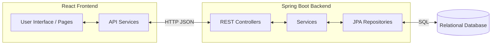

# HappyMed Inventory System Walkthrough

Welcome to the **HappyMed Inventory System**! This is a full-stack web application designed to help a pharmacy or clinic manage their medicine inventory, track sales, and monitor stock levels. 

Here is a comprehensive walkthrough of the entire system, covering its architecture, tech stack, and how the core features work together.

## 🛠️ Tech Stack

The application follows a standard modern client-server architecture.

### **Frontend (React)**
- **Framework**: React.js (Bootstrapped with Vite)
- **Styling**: Vanilla CSS (`index.css`) with modern UI trends (glassmorphism, CSS variables, micro-animations).
- **Icons**: Inline SVG components for lightweight, fast-loading icons.
- **Routing**: React Router (manages navigation between Dashboard, Medicines, Reports, etc.).
- **State Management**: React Hooks (`useState`, `useEffect`).

### **Backend (Spring Boot)**
- **Framework**: Java Spring Boot
- **Architecture**: Classic MVC (Model-View-Controller) layered architecture (`Controller` -> `Service` -> `Repository`).
- **Database Access**: Spring Data JPA / Hibernate.
- **Security & Auth**: JWT-based authentication (`AuthController.java`).
- **Build Tool**: Maven (`pom.xml`).

---

## 🏗️ System Architecture & Data Flow

The system operates by having the React frontend consume RESTful APIs exposed by the Spring Boot backend. 

---

## 🗄️ Core Entities & Database Structure

The backend is built around a few critical database entities that define how the pharmacy operates:

1. **`Medicine`**: The central entity. Stores details like `itemName`, `itemCode`, `genericName`, `category`, `unitPrice`, `sellingPrice`, `expiryDate`, and the current `stockQuantity`. It also holds the `lowStockCount` threshold.
2. **`StockIn`**: Represents adding inventory. It links to a `Medicine`, a `Supplier`, and records the date, quantity received, and batch numbers.
3. **`StockOut`**: Represents dispensing or selling a medicine. It records the `medicineId`, `quantitySold`, `pharmacist`, `prescriptionNo`, and `dateDispensed`. This is what drives the revenue and profit calculations.
4. **`Supplier`**: Information about the vendors providing the medicines.
5. **`UserAccount` & `UserRole`**: Manages the users (pharmacists, admins) who can log in to the system.
6. **`AuditLog`**: Tracks system activities for security and accountability.

---

## ⚙️ Key Workflows

### 1. Medicine Management (`MedicinesPage.jsx` & `MedicineController.java`)
- **Adding a Medicine**: A user fills out the `MedicineForm.jsx`. The frontend calls `medicineService.js`, which hits the `POST /api/medicines` endpoint. The backend saves this new record to the database.
- **Low Stock Alerts**: When a medicine's `stockQuantity` falls below its `lowStockCount` threshold, it is automatically flagged. The Dashboard queries this to populate the "Low Stock Items" table.

### 2. Stock Management (`StockIn` & `StockOut`)
- **Stocking In**: When a delivery arrives, a `StockIn` record is created. The `StockInService` will automatically find the related `Medicine` and **increase** its `stockQuantity`.
- **Dispensing / Selling**: When a pharmacist dispenses a medicine, a `StockOut` record is created. The `StockOutService` will deduct the quantity from the `Medicine`'s `stockQuantity`. 

### 3. Financial Reports & Dashboard (`DashboardPage.jsx` & `ReportService.java`)
The dashboard is the central hub for the business owner.
- **Fetching Data**: The dashboard makes simultaneous calls to fetch `medicines` and `financials`.
- **Metrics Calculation**:
  - **Total Customers**: The system counts the number of `StockOut` transactions for the current month.
  - **Total Sales & Profit**: The backend iterates through the `StockOut` records for the month, calculates the revenue (`quantity * sellingPrice`) and the profit (`quantity * (sellingPrice - unitPrice)`), and returns it to the UI.
  - **Out of Stock**: The frontend filters the `medicines` list to find how many items have a quantity of `0` or less.

### 4. Authentication Flow (`AuthController.java`)
- Users log in with a username and password.
- The backend validates the credentials and issues a **JWT (JSON Web Token)**.
- The frontend stores this token in `localStorage` and attaches it to the `Authorization: Bearer <token>` header for all subsequent protected API calls (managed in the `authHeaders()` utility in the frontend services).

---

## 📁 Directory Structure Overview

### Frontend (`/HappyMed-Frontend/HappyMed/`)
- `src/pages/` - Top-level React components representing entire views (e.g., `DashboardPage.jsx`, `MedicinesPage.jsx`).
- `src/components/` - Reusable UI elements (e.g., `MedicineForm.jsx`, `MedicineTable.jsx`).
- `src/layout/` - Wrappers for pages (e.g., `DashboardLayout.jsx` containing the Sidebar and Header).
- `src/services/` - Modules that handle `fetch()` API calls to the backend (`medicineService.js`, `reportService.js`).
- `src/index.css` - The global stylesheet containing the premium custom design system (variables, animations, component styles).

### Backend (`/HappyMed-Backend/`)
- `src/main/java/.../controller/` - Exposes REST endpoints (`@RestController`).
- `src/main/java/.../service/` - Contains the business logic (`@Service`).
- `src/main/java/.../repository/` - Interfaces extending `JpaRepository` for DB operations.
- `src/main/java/.../entity/` - JPA database models (`@Entity`).
- `src/main/java/.../dto/` - Data Transfer Objects used to shape the JSON payloads (e.g., `ReportDTO.java`).

---

> [!TIP]
> **Next Steps or Enhancements**
> If you are looking to expand this system, common next steps for systems like this include adding a dedicated **Point of Sale (POS)** UI for rapid checkout, creating a comprehensive **Reporting** page with PDF/Excel exports, or expanding the **Audit Logging** to track which specific user modified a medicine's price.
